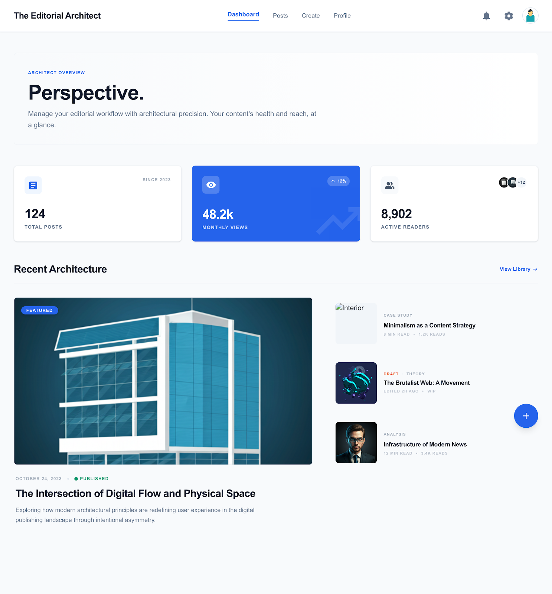
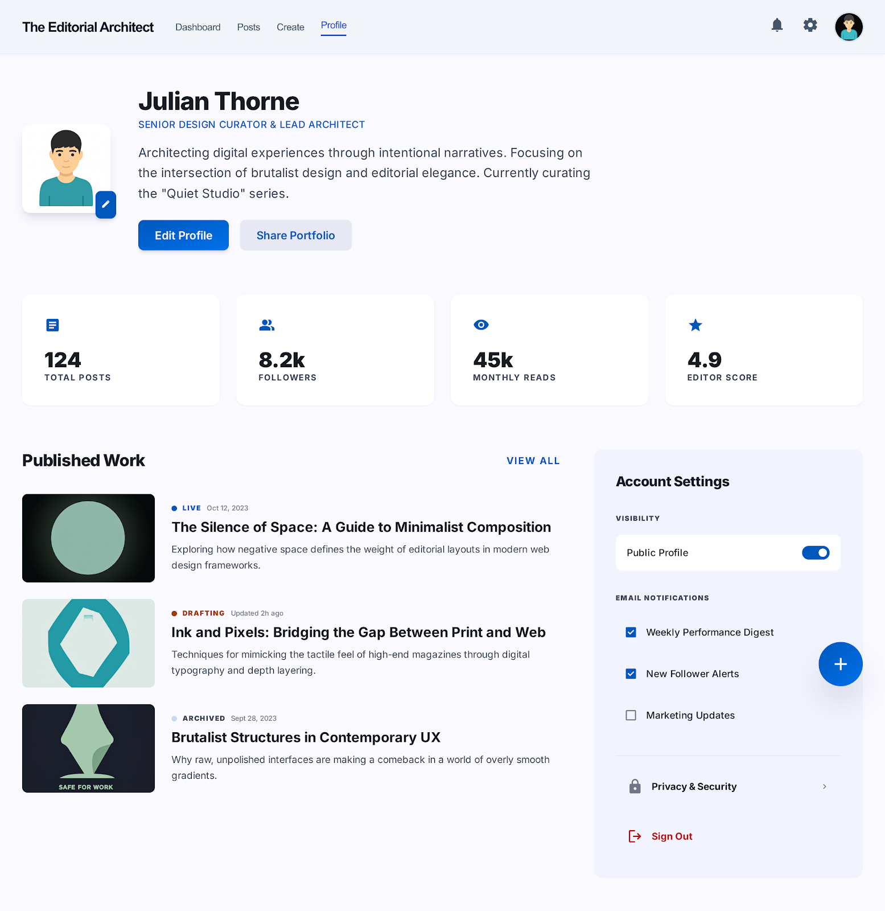

# 🏛️ The Editorial Architect

A modern, mobile-first blog management system for content creators and teams.  
Full-stack app with **FastAPI backend**, **Angular frontend**, and professional responsive UI.

---

## ✨ Key Features

- 🔑 Login & Register  
- 📊 Dashboard (stats & recent posts)  
- 📝 Posts Management: create, edit, view, search  
- 📖 Post Details  
- 👤 User Profile  
- 📱 Mobile-first responsive design

---

## 🛠 Tech Stack

| Layer       | Technology |
|------------|------------|
| ⚡ Backend | FastAPI (Python) |
| 🌐 Frontend | Angular |
| 🗄 Database | MySQL |
| 🎨 Styling | CSS / Gradients / Shadows |
| 🛠 Tools | Docker, VS Code, Git |

---

## 🎨 UI / Design

- Primary color: Blue (#2563EB)  
- Soft gradients for backgrounds and headers  
- Rounded corners & shadows for cards/inputs  
- Hover effects on buttons and cards  
- Mobile-first, responsive layout

---

### 💻 Project Preview

  

You can also view the project demo video here:  
[LinkedIn Publication](https://www.linkedin.com/posts/andreaherediarodriguez_fullstackdev-angular-fastapi-activity-7442993855546806272-3FCT?utm_source=share&utm_medium=member_desktop&rcm=ACoAADWA2xEBY0hSDF7h7KjBBRBPyDPlQLbBi-w)

---

### 🛠 Tools Used

- **Google Stitch** – design layout  
- **ScreenToGif** – record scroll for mobile demo  
- **Canva** – desktop version mockups

---

## 🔗 Links

- Backend API: [Swagger](http://127.0.0.1:8000/docs)  
- Frontend live demo: (add link if deployed)

---

## ✅ Why Recruiters Will Love This

- 💻 Demonstrates full-stack development skills  
- 🎨 Shows professional UI/UX design  
- 📱 Mobile-first, responsive  
- 🐳 Ready for deployment with Docker  
- ✨ Clean, structured code and documentation
- 🎓 Intensive Bootcamp Training – completed hands-on full-stack program, enhancing skills in FastAPI, Angular, and professional project workflow

---

## ▶️ How to run

- Frontend:
npm install  
ng serve  

- Backend:
pip install -r requirements.txt  
fastapi dev main.py  

---

## 📌 Status
Project in active development
